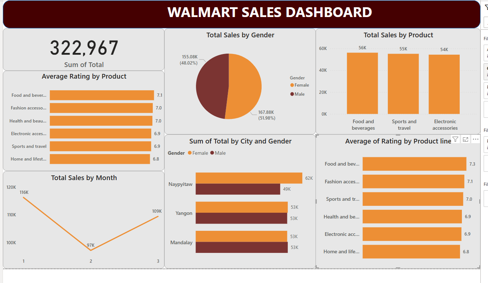

# 🛒 Walmart Sales Analysis using SQL & Power BI

This project showcases a comprehensive sales analysis for Walmart using SQL for data querying and transformation, and Power BI for interactive data visualization. The goal is to extract meaningful business insights and present them in an insightful dashboard.

---

## 📌 Project Overview

- **Domain**: Retail / E-commerce
- **Tools Used**: SQL (MySQL), Power BI
- **Skills Applied**: Data Cleaning, Data Transformation, Data Analysis, Data Visualization, Dashboarding

---

## 📊 Power BI Dashboard

---

## 🗃️ Dataset Summary

- **Source**: Walmart sales data from 3 branches in 3 different cities
- **Features**:
  - Invoice ID, Branch, City, Customer Type, Gender
  - Product Line, Unit Price, Quantity, Total
  - Payment Method, Date, Time, Gross Income, Rating

---

## 🔍 Key Insights

- 🏆 **Top-Selling Product Line**: *Food and Beverages* and *Sports and Travel* lead in total sales.
- 👨‍👩‍👧‍👦 **Customer Segmentation**: Sales are nearly evenly distributed between male and female customers.
- 🗓️ **Peak Month**: Month 1 recorded the highest sales across all three branches.
- 🏙️ **Top-Performing City**: *Naypyitaw* had the highest overall sales.
- 💳 **Payment Trends**: Customers prefer using *Ewallets*, followed by *Cash* and *Credit cards*.

---

## 📁 Project Structure

## ⚙️ SQL Tasks Performed

- Handled missing/null values
- Converted data types
- Extracted date parts (day, month, year)
- Aggregated KPIs by branch, gender, and product line
- Identified peak sales trends and customer behavior

---

## 📈 Power BI Features Used

- Bar & Column Charts
- Line Graphs
- Slicers for dynamic filtering
- KPIs and Cards
- Pie Charts for category distribution

---

## 📌 Conclusion

This project provides valuable insights into Walmart's branch-wise and product-wise performance, customer preferences, and sales trends. The combination of SQL and Power BI makes it easy to explore and present actionable insights for data-driven decision-making.

---
